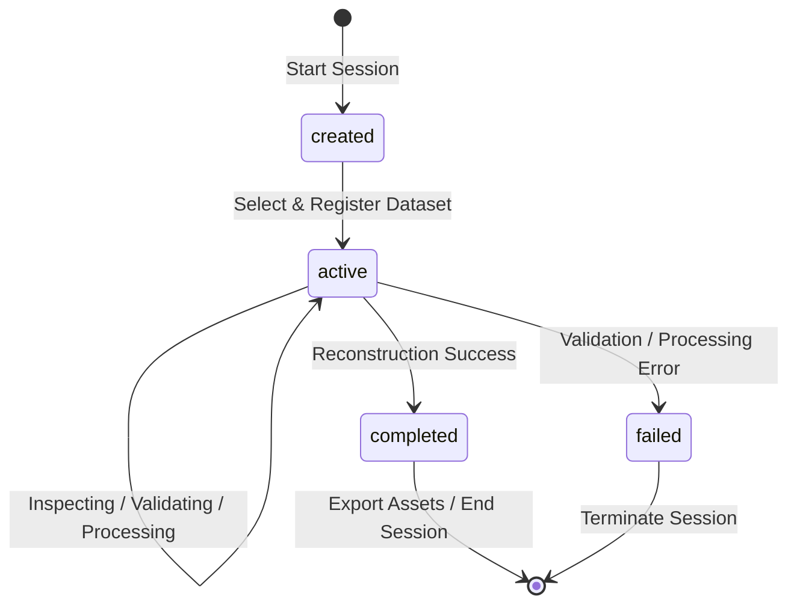

# Analysis Session Lifecycle Design

This document details the design of the **Analysis Session** lifecycle state machine for the AI-Powered Geospatial Reconstruction Platform. 

Every geospatial reconstruction run takes place within an isolated session context. The session lifecycle orchestrates and reports on the transition of stages from initial dataset landing to final output export.

---

## 1. Lifecycle States

The session supports four core lifecycle states:

| State | Description | Transition Trigger |
|---|---|---|
| `created` | Session is initialized. No dataset has been selected or registered yet. | Automatic upon session creation request. |
| `active` | Dataset selected and registered. Platform is actively inspecting, validating, or running reconstruction. | Triggered when a dataset is successfully associated with the session. |
| `completed` | Core reconstruction pipeline, confidence generation, and visualization assets are ready for export. | Triggered when the Reconstruction and Confidence Intelligence layers succeed. |
| `failed` | Processing was aborted due to critical validation errors, extraction failures, or model failure. | Triggered if any step fails validation or throws unhandled processing errors. |

---

## 2. State Machine Diagram

---

## 3. Transition Conditions

### Created → Active
- **Condition**: User selects a built-in demo dataset or completes uploading a custom dataset.
- **Action**: Platform creates a dataset registration record mapping the `session_id`, sets session status to `active`, and begins the inspection phase.

### Active → Active (Internal Sub-states)
While the session is `active`, the platform tracks and reports its sub-stage processing status (e.g., in logs or dynamic progress updates):
1. `DATASET_INSPECTED`
2. `DATASET_VALIDATED`
3. `METADATA_EXTRACTED`
4. `TEMPORAL_CONTEXT_RETRIEVED`
5. `RECONSTRUCTION_RUNNING`
6. `CONFIDENCE_GENERATING`

### Active → Completed
- **Condition**: All bands are successfully reconstructed, confidence heatmaps generated, and visualization previews written.
- **Action**: Session status is updated to `completed`. The session page unlocks the Export Command Center.

### Active → Failed
- **Condition**: High-level failures occur (e.g., invalid TIFF metadata, unreadable raster bands, or GPU out-of-memory errors).
- **Action**: Session status is updated to `failed` and diagnostic messages are appended to the session context.
