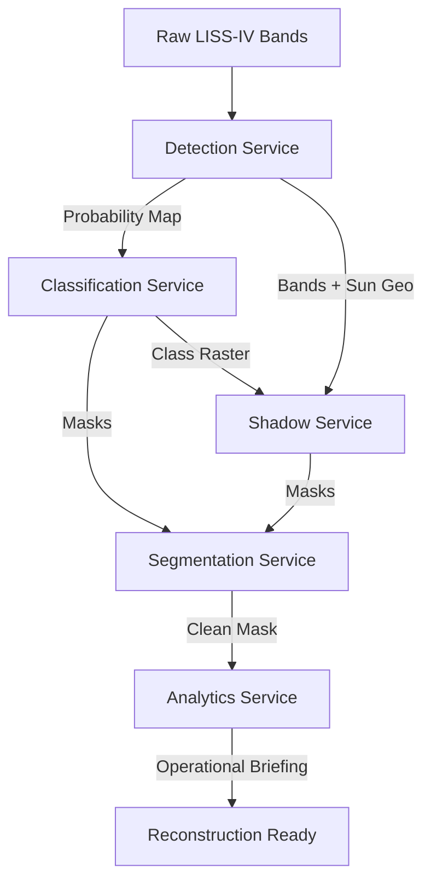

# PROJECT DEEP DIVE: ARCHITECTURAL SPECIFICATIONS AND OPERATIONAL ANALYSIS

This document provides a detailed technical analysis of the Generative AI-based Cloud Removal and Reconstruction Platform for LISS-IV Satellite Imagery.

---

## 1. Reconstruction Mechanics

### Model Architecture & Input Structure
The platform utilizes a **U-Net Autoencoder** (`LISS4ReconstructionNet`) implemented in PyTorch, which is dynamically compiled and serialized to ONNX or TorchScript.
- **Input Channels (7)**:
  1. Masked Target Image Bands (B2, B3, B4) — normalized to `[0.0, 1.0]` (3 channels).
  2. Binary Reconstruction Mask — `1` for clouded/shadowed pixels to reconstruct, `0` for clean background (1 channel).
  3. Spatial-Temporal Guidance Composite — cloud-free baseline reference (3 channels).
- **Output Channels (3)**: Restored spectral bands (B2, B3, B4) corresponding to green, red, and NIR wavelengths.
- **Skip Connections**: Bridge contracting encoder layers directly to upsampling decoder layers to preserve high-frequency spatial structures, road network continuities, and river boundaries.

### Self-Supervised Local Adaptation (DIP-Style)
Rather than relying on generic pre-trained weights that fail on localized topography, the platform performs **Deep Image Prior (DIP) style self-supervised weight fitting** (`fit_model_on_unmasked_patches`):
1. **Patch Extraction**: Scans the target image for up to 4 clean (unclouded) $128 \times 128$ pixel patches.
2. **Synthetic Masking**: Simulates a reconstruction task by masking out a central $64 \times 64$ region within the clean patches.
3. **Local Optimization**: Fits U-Net weights for 25 epochs using the Adam optimizer ($lr=0.01$).
4. **Loss Formulation**:
   - **Reconstruction Loss**: L1 loss comparing output to ground truth inside the synthetic mask.
   - **Boundary Continuity (Edge) Loss**: First-order spatial gradients difference to enforce spectral texture smoothness across reconstruction borders.

### Inference & Overlapping Tile-Based Reconstruction (OLA)
To handle large-scale scenes without exceeding VRAM/RAM limits, the platform executes overlapping tile-based reconstruction:
- **Tiling Grid**: Processes the target image using a tile size of $512 \times 512$ with a boundary padding of $32$.
- **OLA Blending**: Overlapping regions are merged using a linear-blend distance weight map ($W_{tile}$) which smoothly transitions between adjacent patches, neutralizing visible seam lines and grid boundaries.
- **Selective Processing**: Clean tiles (no clouded/shadowed pixels) bypass model execution entirely and copy the original imagery.

### Classical Fallback
If PyTorch or ONNX Runtime are unavailable, or if model inference throws an exception, the pipeline gracefully falls back to classical spatial inpainting:
- **Algorithms**: OpenCV's `cv2.INPAINT_TELEA` (Fast Marching Method) or `cv2.INPAINT_NS` (Navier-Stokes fluid dynamics).
- **Execution**: Blended locally inside the tile loop to ensure seamless integration.

> [!IMPORTANT]
> **Computation Check**: This is a genuine deep-learning model-based inference pipeline. Model training (DIP weight fitting) and inference are executed locally using real tensor computations, rather than a cosmetic opacity adjustment on pre-existing static images.

---

## 2. Cloud Intelligence Layers

The cloud intelligence module consists of 5 dedicated service layers executing sequential pipelines:

### A. Cloud Detection Service (`cloud_detection_service.py`)
- **Downsampling**: Decimates bands to a maximum width of 2048 pixels via bilinear interpolation to save memory.
- **Spectral Thresholding**:
  - **Brightness Index (BI)**: Average of Green, Red, and NIR channels: $(B2+B3+B4)/3$.
  - **NDVI Suppression**: Suppresses highly reflective vegetation: $(NIR - Red) / (NIR + Red + 1e-6)$.
  - **Whiteness Index**: Standard deviation across the three bands to separate neutral clouds from spectrally colored ground features.
- **Outputs**: Generates a continuous `probability_map.tif`.

### B. Cloud Classification Service (`cloud_classification_service.py`)
- **Connected Components**: Labels clouds using 8-connectivity.
- **Rule-Based Heuristics**: Classifies clouds into *Thick*, *Thin*, *Cirrus*, or *Uncertain* by analyzing:
  - Mean reflection probability.
  - Standard deviation.
  - Spatial area (pixels).
  - Compactness/eccentricity: $Perimeter^2 / (4 \cdot \pi \cdot Area)$.
- **Outputs**: Writes multi-class `classification_map.tif` (Thick=1, Thin=2, Cirrus=3, Uncertain=4).

### C. Cloud Shadow Service (`cloud_shadow_service.py`)
- **Directional Ray Projection**: Calculates shadow locations using solar geometry:
  - Shifts each labeled cloud region opposite the sun azimuth angle: $\theta_{shadow} = \theta_{azimuth} + 180^{\circ}$.
  - Projects rays over a proxy altitude range ($500\text{m}$ to $5000\text{m}$) using a parameterized elevation step-loop.
- **Shadow Detection**: Intersects projected rays with spectral water/dark index candidates (low NDVI, low reflectance).
- **Outputs**: Generates binary `shadow_mask.tif` (Shadow=5).

### D. Cloud Segmentation Service (`cloud_segmentation_service.py`)
- **Morphological Cleanup**:
  - **Closing**: $5 \times 5$ elliptical structuring element to fill internal cloud/shadow gaps.
  - **Opening**: $3 \times 3$ elliptical structuring element to remove tiny noise fragments.
  - **Hole Filling**: Contour drawing algorithms to seal large inner holes.
  - **Small Object Removal**: Filters out components smaller than 16 pixels.
- **Outputs**: Writes unified `segmentation_mask.tif` and `reconstruction_mask.tif`.

### E. Cloud Analytics Service (`cloud_analytics_service.py`)
- **Aggregation**: Compiles statistics from all prior runs.
- **Mathematical Indexes**:
  - **Cloud Burden Index**: Weighted cloud/shadow footprint ratio.
  - **Scene Complexity Score**: Considers object count, size distribution, and classification variance.
  - **Reconstruction Difficulty**: Evaluates difficulty as *LOW*, *MEDIUM*, *HIGH*, or *EXTREME*.
- **Outputs**: Generates JSON summary reports and operational mission command briefs.

### Performance Profile & Bottlenecks
1. **Ray Projection CPU Thrashing**: In `cloud_shadow_service.py`, the nested loops mapping each cloud component against 900 elevation steps ($t\_steps$) allocate hundreds of thousands of NumPy slices, leading to CPU cache thrashing.
2. **Boolean Array Scans**: In `cloud_segmentation_service.py` and `cloud_classification_service.py`, doing `reconstruction_mask[labeled_mask == r.label] = 1` inside a Python loop scans the full 2D array for every single connected component, causing $O(N \cdot P)$ overhead where $N$ is the number of regions and $P$ is the image size.

---

## 3. Temporal Discovery & GEE Fetching Architecture

### Catalog Queries
The discovery engine filters the global Google Earth Engine (GEE) archives matching the coordinates of the target LISS-IV scene:
- **UTM bounds** from the target scene's GeoTIFF are transformed to WGS84 coordinates (`transform_bounds`).
- Temporal window limits search ranges (default: $\pm 30$ days of target acquisition date).
- Queries `LANDSAT/LC08/C02/T1_L2` and `COPERNICUS/S2_SR_HARMONIZED` collections, filtering for clouds $<30\%$.

### Preview Generation (`getThumbURL`)
Instead of downloading gigabyte-scale datasets for candidate evaluation, the platform queries GEE's on-the-fly rendering capabilities:
- Constructs a localized RGB visualization image mapping `["B4", "B3", "B2"]` (Sentinel-2) or `["SR_B4", "SR_B3", "SR_B2"]` (Landsat-8) bands.
- Calls GEE's `getThumbURL` API, which streams a 256px wide preview PNG.

### Cache-Forever Policy
To guarantee rapid preview rendering and stay within GEE API limits:
- When a candidate preview is requested, the service hashes the candidate's GEE asset ID to resolve a local path: `datasets/temporal_references/previews/{session_id}/{candidate_db_id}.png`.
- **CACHE HIT**: If the PNG exists on disk, it is returned instantly via `FileResponse`, bypassing Earth Engine initialization and GEE network requests.
- **CACHE MISS**: If not found, GEE client is initialized, the thumbnail is retrieved, saved to disk, and returned.

---

## 4. Repository Cleanup Analysis

The following breakdown outlines core production files versus candidates for cleanup:

| Category | Path | Purpose | Status |
| :--- | :--- | :--- | :--- |
| **Core Service** | `backend/app/services/temporal_service.py` | GEE orchestration and preview generator. | **Production Essential** |
| **Core Service** | `backend/app/services/reconstruction/` | Model definition, DIP loop, tile blending. | **Production Essential** |
| **Core Service** | `backend/app/services/cloud_*.py` | Five-layer cloud analytics and mask generation. | **Production Essential** |
| **Diagnostic Script** | `backend/verify_batch_c.py` | End-to-end regression validation. | **Retain for CI/CD** |
| **Diagnostic Script** | `backend/verify_phase_7c.py` | Validates GEE preview cache & reconstruction. | **Retain for CI/CD** |
| **Scratch Script** | `C:\Users\abhin\...\scratch\clean_datasets.py` | Purges transient session folders. | **Safe to Delete** |
| **Scratch Script** | `C:\Users\abhin\...\scratch\run_preview_test.py` | Verifies cache hit/miss logic. | **Safe to Delete** |

---

## 5. Performance Roadmaps

To prepare for high-throughput operational scaling, the following refactoring roadmap is recommended:

### A. Vectorizing Ray Projection (Shadow Service)
- **Problem**: Individual shifts for every component at every height step.
- **Solution**: Use 3D NumPy array broadcasting to project shadows in a single operation. Instead of looping, stack shifted arrays along a 3rd axis and compute the element-wise maximum.

### B. Optimizing Connected Components Masking (Segmentation & Classification)
- **Problem**: `(labeled_mask == r.label)` scans the whole image for each region.
- **Solution**: Replace the loop with OpenCV's vectorized `cv2.connectedComponentsWithStats` or use `scikit-image`'s `regionprops` coordinate slices (`r.slice`), which only crop localized bounding boxes instead of scanning the full canvas.
