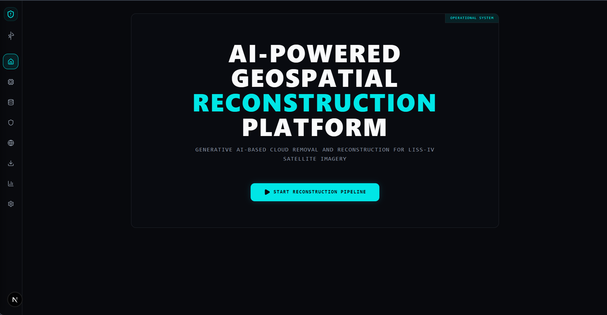
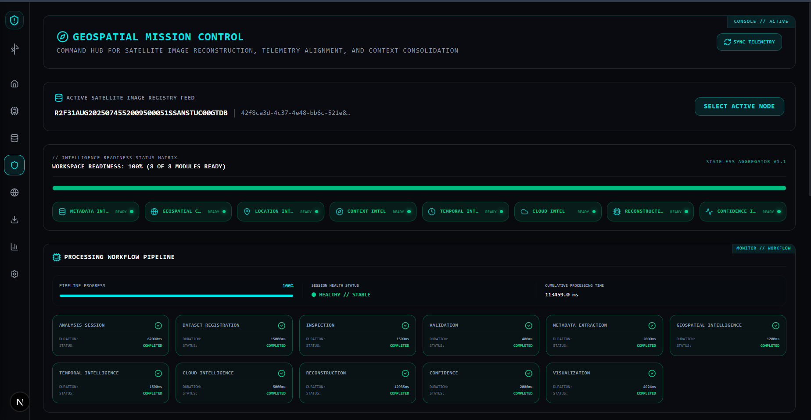
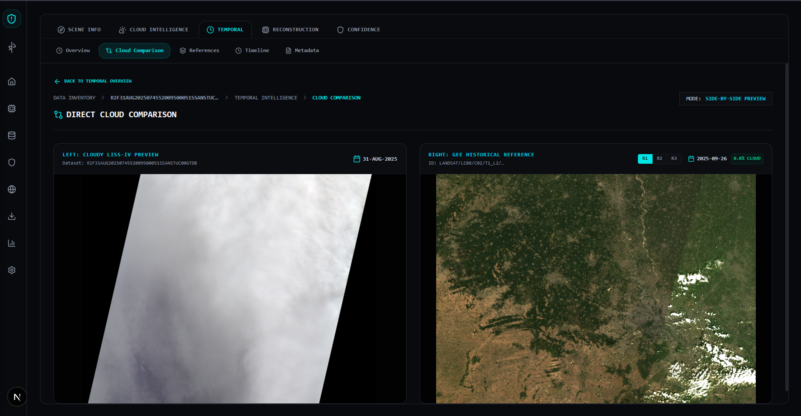
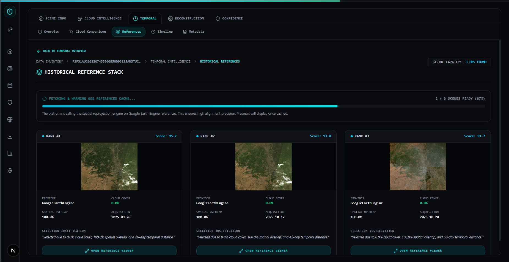

<p align="center">
  
</p>

<p align="center">
  
  
  
  
  
</p>

<p align="center">
  An operational end-to-end platform designed to detect, analyze, and reconstruct cloud-covered LISS-IV satellite imagery using dual-source temporal discovery, Google Earth Engine integration, and deep neural networks.
</p>

<p align="center">
  🌍 <b>Live Console:</b> <a href="https://isro-bah26.vercel.app/" target="_blank">isro-bah26.vercel.app</a>
</p>

---

## 📌 Table of Contents
- [Problem Statement](#-problem-statement)
- [Our Approach](#-our-approach)
- [Key Features](#-key-features)
- [Platform Architecture](#-platform-architecture)
- [Technology Stack](#-technology-stack)
- [Screenshots](#-screenshots)
- [Repository & Dataset Structure](#-repository--dataset-structure)
- [Getting Started](#-getting-started)
  - [Backend Setup](#backend-setup)
  - [Frontend Setup](#frontend-setup)
- [Deployment Configuration](#-deployment-configuration)
- [Future Roadmap](#-future-roadmap)
- [License](#-license)

---

## 🔍 Problem Statement

* **Cloud Occlusion:** LISS-IV optical satellite imagery frequently suffers from significant cloud and shadow contamination, rendering high-resolution data unusable for critical downstream applications.
* **Loss of Continuity:** Data gaps caused by cloud coverage disrupt time-sensitive monitoring frameworks, including agricultural tracking, disaster management, and urban development mapping.
* **Objective:** Build an enterprise-grade Generative AI framework that accurately reconstructs missing spatial zones under clouds while strictly preserving texture boundaries, structural integrity, and native spectral characteristics.

---

## 💡 Our Approach

Instead of functioning purely as an isolated deep learning model, this platform operates as an integrated multi-stage pipeline:

1. **Dual-Source Temporal Intelligence:** Queries local historical imagery catalogs first. If an adequate local reference is unavailable for the target bounding box and temporal window, the engine interfaces directly with Google Earth Engine (Sentinel-2 and Landsat-8) to fetch optimal, cloud-free historical reference tiles matching the exact geographic footprint.
2. **Cloud Intelligence Engine:** Applies calibrated multi-band thresholds (NDVI, brightness, whiteness matrices) optimized with per-dataset percentile algorithms to segment both dense cloud covers and volatile cloud shadows.
3. **AI Reconstruction Engine:** Utilizes a specialized U-Net architecture that treats the retrieved historical reference as contextual guidance rather than a direct pixel replacement, successfully recovering high-frequency spatial details and micro-textures.
4. **Confidence Intelligence Layer:** Computes pixel-level and regional confidence matrices, generating reliability heatmaps so analysts can quantitatively evaluate the accuracy of reconstructed domains.

---

## 🚀 Key Features

* **Automated Cloud/Shadow Segmentation:** Pixel-perfect mask extraction leveraging spectral data indices.
* **Dynamic Earth Engine Cross-Referencing:** On-the-fly acquisition of cloud-free comparative datasets.
* **Guided Deep Learning U-Net Pipeline:** Context-aware spatial synthesis without structural artifacts.
* **Granular Confidence Heatmaps:** Mathematical error-bound and reliability reporting across output tiles.
* **Interactive GIS Dashboard:** Seamless side-by-side comparative views driven by MapLibre vector maps.

---

## 🏗️ Platform Architecture

```text
                  ┌───────────────────────────────┐
                  │      Frontend (Next.js)       │
                  └──────────────┬────────────────┘
                                 │
                                 ▼
                  ┌───────────────────────────────┐
                  │        FastAPI Backend        │
                  └──────────────┬────────────────┘
                                 │
         ┌───────────────────────┼───────────────────────┐
         ▼                       ▼                       ▼
┌─────────────────┐     ┌─────────────────┐     ┌─────────────────┐
│ Dataset Manager │     │ Cloud Intel     │     │ Temporal Intel  │
└─────────────────┘     └─────────────────┘     └────────┬────────┘
         │                       │                       │
         ▼                       ▼                       ▼
┌─────────────────┐     ┌─────────────────┐     ┌─────────────────┐
│   PyTorch Model │     │ Confidence Calc │     │ Google Earth Eng│
└────────┬────────┘     └────────┬────────┘     └─────────────────┘
         │                       │
         └───────────┬───────────┘
                     ▼
        ┌─────────────────────────┐
        │  Analysis-Ready Output  │
        └─────────────────────────┘

```

---

## 🛠️ Technology Stack

| Component | Technologies Used | Description |
| --- | --- | --- |
| **Backend** |      | High-performance asynchronous REST API, relational tracking, and containerized runtime environments. |
| **Frontend** |     | Interactive dashboard UI, strong type-safety, responsive design, and fluid canvas maps. |
| **Geospatial** |     | Multi-spectral data parsing, metadata coordinate mapping, and morphological filtering. |
| **Deep Learning** |   | Neural network construction, spatial guidance parsing, and inference execution. |

---

## 📸 Screenshots
<p align="center">
  
  
</p>
<p align="center">
  
  
</p>

---

## 📁 Repository & Dataset Structure

<table>
<tr>
<td width="50%" valign="top">

### File Layout

```text
isro-bah26/
├── backend/          # FastAPI Source, Models, & Route Logic
├── frontend/         # Next.js Application & Mapping Client
├── datasets/         # Local Datasets & Upload Buffers
└── Docs/             # Technical Documentation & References
```

* **Frontend**: Next.js client renders interactive satellite scene previews and triggers the reconstruction pipeline.
* **Backend**: FastAPI manages task scheduling, SQLite logs, and runs the PyTorch model.
* **AI & GIS**: PyTorch + ONNX Runtime run the U-Net model and process GeoTIFF bands.
* **GEE**: Automatically queries and fetches cloud-free reference imagery.

</td>
<td width="50%" valign="top">

### Dataset Requirements

```text
demo/<DATASET_NAME>/
├── BAND2.tif         # Green Band (GeoTIFF format)
├── BAND3.tif         # Red Band (GeoTIFF format)
├── BAND4.tif         # Near-Infrared / NIR Band (GeoTIFF format)
├── BAND_META.txt     # Native sensor parameters
├── ACC_REP.txt       # Processing validation records
├── preview.jpg       # Static RGB asset fallback
└── metadata.meta     # Geographic bounding coordinates
```

Create a new folder inside `datasets/demo/` named after your dataset. Place all files directly in that folder.

</td>
</tr>
</table>

---

## ⚡ Getting Started

### Backend Setup

1. **Clone the repository and enter backend directory:**
```bash
git clone https://github.com/InnovateX-SMIT/isro-bah26.git
cd isro-bah26/backend
```

2. **Initialize your virtual environment:**
* **Windows:**
```bash
python -m venv .venv
.venv\Scripts\activate
```

* **Linux/macOS:**
```bash
python -m venv .venv
source .venv/bin/activate
```

3. **Install application dependencies:**
```bash
pip install -r requirements.txt
```

4. **Configure Google Earth Engine (GEE) Authentication:**
* **Option A (File-Based):** Save your service account credential token key to:
`backend/credentials/gee-service-account.json`
* **Option B (Environment-Based):** Pass the raw JSON string as the value for the `GEE_SERVICE_ACCOUNT_JSON` environment variable.

5. **Initialize environmental variables:**
```bash
cp .env.example .env
```

6. **Boot up the FastAPI server core:**
```bash
python -m uvicorn app.main:app --host 127.0.0.1 --port 8000 --reload
```

### Frontend Setup

1. **Navigate into the frontend project root:**
```bash
cd ../frontend
```

2. **Install Node.js packages:**
```bash
npm install
```

3. **Configure the target environment configuration:**
Construct a `.env` file from your local template and define your API connection path:
```env
NEXT_PUBLIC_API_URL=http://localhost:8000
```

4. **Run the local development interface:**
```bash
npm run dev
```

The interactive system dashboard will now be reachable at `http://localhost:3000`.

---

## 🌐 Deployment Configuration

### Production Backend (Railway)

The server component is built to deploy reliably on **Railway** utilizing the embedded `Dockerfile`. Ensure your live environment configuration provides valid Google Earth Engine access configurations.

### Production Frontend (Vercel)

The client layer is fine-tuned for optimal hosting on **Vercel**. Link the target workspace and set your API production path key:

```env
NEXT_PUBLIC_API_URL=https://isro-bah26-production.up.railway.app
```

---

## 🗺️ Future Roadmap

* [ ] **Multi-Temporal Data Fusion:** Incorporating sequential temporal stacks to extract persistent land trends.
* [ ] **Structural Optimization:** Porting the U-Net architecture framework directly into TensorRT/ONNX runtimes for minimized inference latency.
* [ ] **Expanded Sensor Compatibility:** Extending structural synthesis support to handle mixed bands from LISS-III, AWIFS, and Sentinel configurations.

---

## 📄 License

Developed exclusively by team **InnovateX-SMIT** for the **ISRO Bharatiya Antariksh Hackathon 2026**.

Please refer to the repository license documentation for usage parameters.